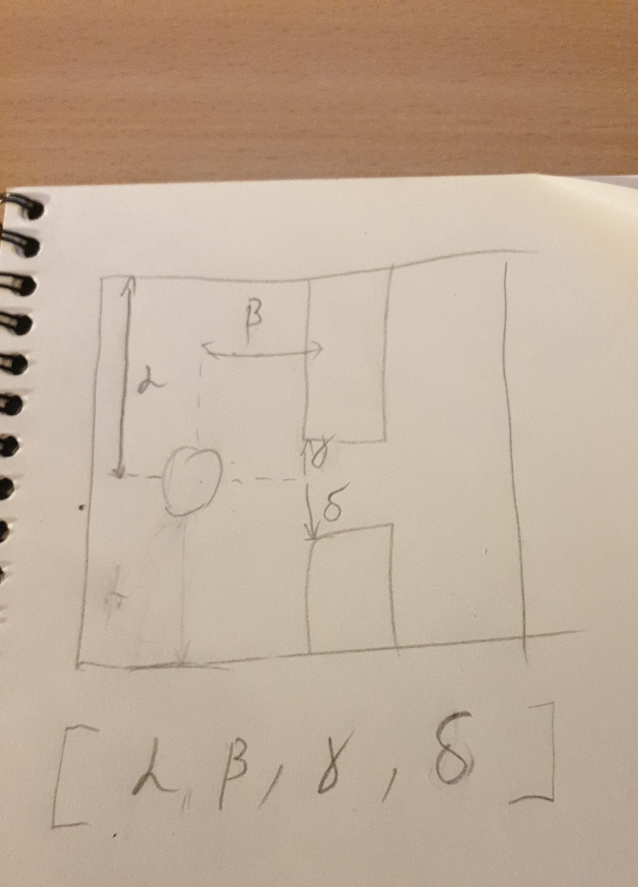

# flappy-ai

🐥 A Neural Network + Genetic Algorithm which plays Flappy Bird

A genetic algorithm with a neural network ([fr3fou/gone](https://github.com/fr3fou/gone)) built on top of [fr3fou/flappy-go](https://github.com/fr3fou/flappy-go) which plays flappy bird.

The core game is reused and built on top of using composition

```go
type Game struct {
    *flappy.Game
    // extra fields only used from the AI
}
```

```go
type Bird struct {
    *flappy.Bird
    // extra fields only used from the AI
}
```

## AI Architecture

500 birds in total are put in the game with the following architecutre of their brain

```go
var BrainLayers = []gone.Layer{
 {
  Nodes:     5,
  Activator: gone.Sigmoid(),
 },
 {
  Nodes:     8,
  Activator: gone.Sigmoid(),
 },
 {
  Nodes:     2,
  Activator: gone.Sigmoid(), // ideally should be softmax
 },
}
```

There are 5 inputs, 4 of them described in the following image and the last 1 is the velocity of the bird



The 2 outputs determine whether the bird should jump or not

```go
if output[0] > output[1] {
    bird.Jump()
}
```

Their score is determined by how well they perform (how long they survive)
